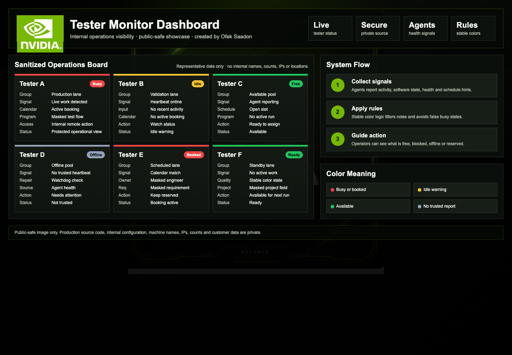
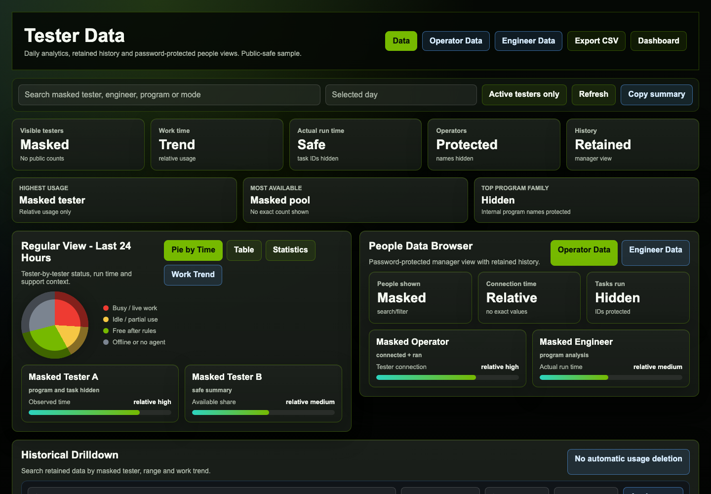
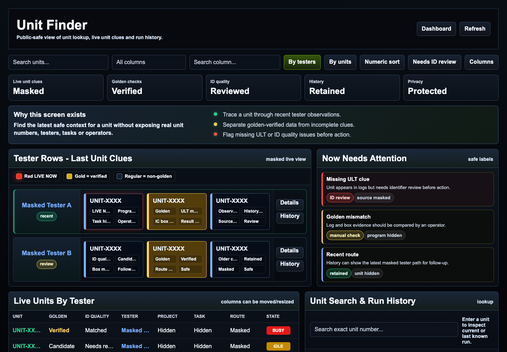
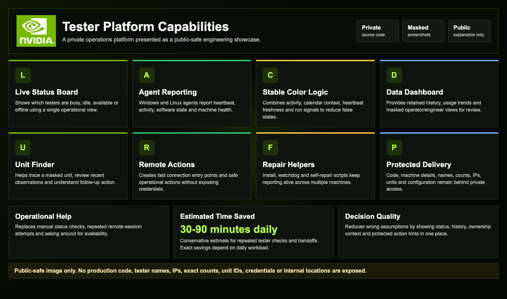
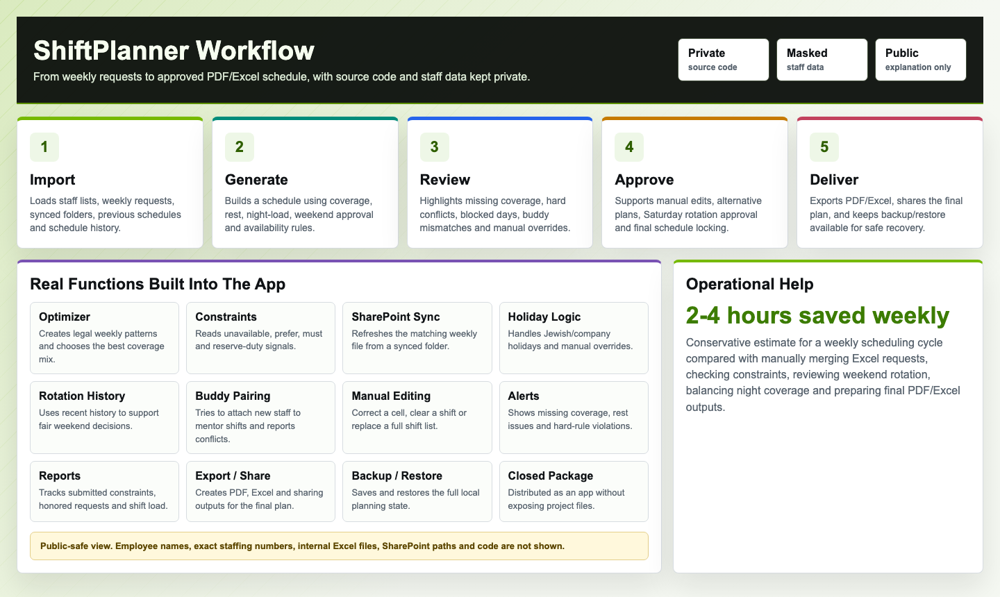
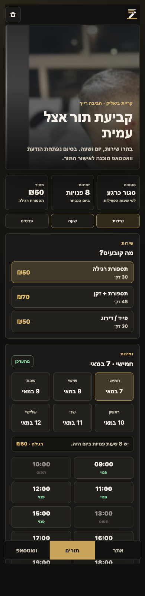
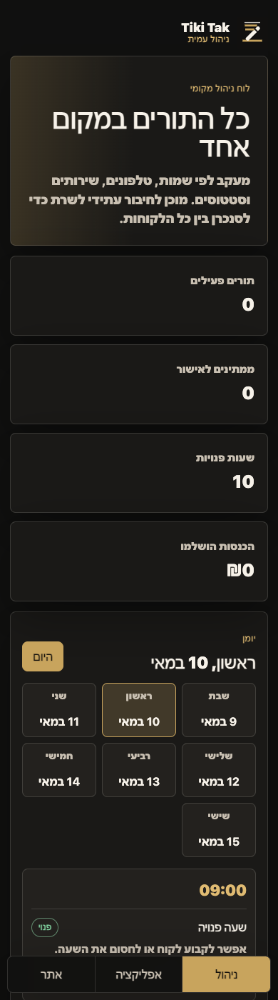

# Ofek Saadon

I build practical software for real operations: internal dashboards, scheduling systems, automation helpers and mobile-first web experiences.

## Recent Work

### Tester Monitor Dashboard

Private internal tester operations platform for live status, agent health, stable color logic, data analytics and unit lookup.

What I built:

- Live tester availability view across busy, idle, free and offline states.
- Stable color rules that reduce false busy/free decisions.
- Windows/Linux agent reporting for heartbeat, activity and machine health.
- Data Dashboard for retained history, tester usage, operator data and engineer data.
- Unit Finder for masked unit lookup, recent observations, Golden/ULT review and run history.
- Protected connection helpers, repair helpers and public-safe documentation.

Estimated impact: **30-90 minutes saved per active workday** for repeated tester checks, handoffs and status verification.

Public showcase: [dashboard-showcase](https://github.com/ofek-avi/dashboard-showcase)  
Source code: private

### ShiftPlanner

Private workforce scheduling tool for weekly shift planning, constraints, history, review and final PDF/Excel delivery.

What I built:

- Excel/CSV employee import and weekly constraint import.
- SharePoint/OneDrive synced-folder refresh for weekly files.
- Automatic schedule generation with coverage, rest, night-load and weekend rotation rules.
- Buddy pairing, manual editing, alerts, tracking reports and approval workflow.
- Holiday handling, history-based rotation, backup/restore and closed app packaging.

Estimated impact: **2-4 hours saved per weekly schedule cycle** by reducing manual Excel merging, constraint checking, rotation review, exception handling and final file preparation.

Public showcase: [shiftplanner-showcase](https://github.com/ofek-avi/shiftplanner-showcase)  
Source code: private

## Website Project

### Tiki Tak Barber Studio

Mobile-first Hebrew website and PWA for a barber studio, including booking flow, WhatsApp handoff, gallery, FAQ, app-style screen and admin view.

  
  
  

Public showcase: [tikitak-barber-studio-showcase](https://github.com/ofek-avi/tikitak-barber-studio-showcase)  
Source code: private

## Profile Structure

- Public repositories are showcase pages with images and project explanations.
- Work and client/project source code stays private.
- Screenshots are sanitized before publishing.
- Older course exercises are no longer part of the public profile focus.

## Focus Areas

- Operations dashboards
- Unit tracking and internal tooling
- Scheduling and planning systems
- Local-first web tools
- Mobile-first Hebrew websites
- Workflow automation
