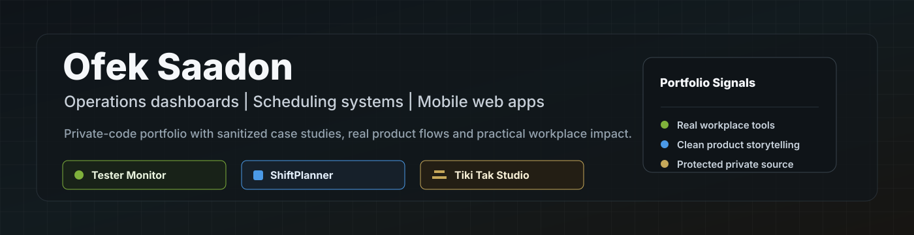

  

# Ofek Saadon

I build practical software for real operations: internal dashboards, scheduling systems, workflow automation and mobile-first web experiences.

My public GitHub is organized as a professional portfolio. Work projects stay private, while public repositories show sanitized screenshots, product thinking, user flows and the operational value of each system.

## Selected Portfolio

| Project | Type | What it solves | Public showcase | Source |
| --- | --- | --- | --- | --- |
| Tester Monitor Dashboard | Internal operations platform | Helps teams understand tester status, unit movement, history and connection context without manual checks. | [dashboard-showcase](https://github.com/ofek-avi/dashboard-showcase) | Private |
| ShiftPlanner | Workforce scheduling tool | Turns weekly Excel-heavy scheduling into a guided workflow with rules, alerts, exports and review. | [shiftplanner-showcase](https://github.com/ofek-avi/shiftplanner-showcase) | Private |
| Tiki Tak Barber Studio | Mobile-first website and booking app | Presents a barber business with a clean mobile site, booking flow, WhatsApp handoff and admin view. | [tikitak-barber-studio-showcase](https://github.com/ofek-avi/tikitak-barber-studio-showcase) | Private |

## Recent Work

### Tester Monitor Dashboard

Private internal tester operations platform for live tester status, stable color logic, data analytics and unit lookup.

**What I built**

- Live availability board for busy, idle, free and offline states.
- Stable color rules that reduce false busy/free decisions by combining heartbeat, activity, calendar context and run signals.
- Windows/Linux agent reporting for machine health, software state and activity freshness.
- Data Dashboard for retained history, usage patterns, operator context and engineering review.
- Unit Finder for masked unit lookup, recent observations, live clues, Golden/ULT review and run history.
- Protected connection helpers, repair helpers and public-safe documentation.

**Estimated operational value:** 30-90 minutes saved per active workday by reducing repeated tester checks, manual handoffs, connection attempts and status verification.

### ShiftPlanner

Private scheduling system for weekly shift planning, constraints, history, review and final PDF/Excel delivery.

**What I built**

- Excel/CSV employee and weekly constraint import.
- SharePoint/OneDrive synced-folder refresh for weekly files.
- Automatic schedule generation with coverage, rest, night-load and weekend rotation rules.
- Buddy pairing, manual editing, conflict alerts and approval workflow.
- Holiday handling, history-based rotation, backup/restore and closed desktop packaging.
- Final schedule export to PDF and Excel for team sharing.

**Estimated operational value:** 2-4 hours saved per weekly schedule cycle by reducing manual Excel merging, constraint checking, rotation review, exception handling and final file preparation.

### Tiki Tak Barber Studio

Mobile-first Hebrew website and PWA-style booking experience for a barber studio, including booking flow, WhatsApp handoff, gallery, FAQ, app-style screen and admin view.

  
  
  

**What I built**

- Responsive mobile landing page with brand visuals and service presentation.
- Appointment request flow with selected service, date and time.
- WhatsApp handoff that carries booking details into the conversation.
- PWA-style app screen for a focused mobile experience.
- Admin view for appointments, availability and business overview.
- Public-safe screenshots with private business details removed.

## How This Profile Is Organized

- Public repositories are showcase pages with images and professional project explanations.
- Work and client/project source code remains private.
- Screenshots are sanitized before publishing.
- Older course exercises are kept out of the main public profile focus.
- The profile highlights recent, practical work first.

## Focus Areas

- Operations dashboards
- Internal workflow tools
- Scheduling and planning systems
- Unit tracking and lookup flows
- Local-first web tools
- Mobile-first Hebrew websites
- Automation that saves manual work
